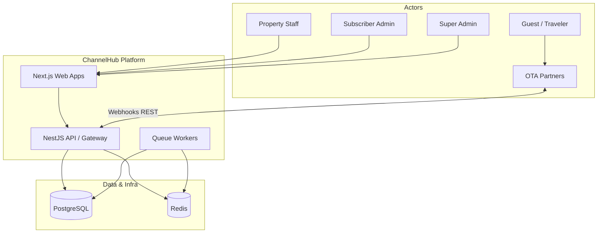

# System Context Diagram

## Purpose

Menunjukkan aktor eksternal dan platform ChannelHub.

## References

- docs/02-product-architecture/001-system-overview.md
- adr/ADR-010-monorepo-blueprint-repository.md
