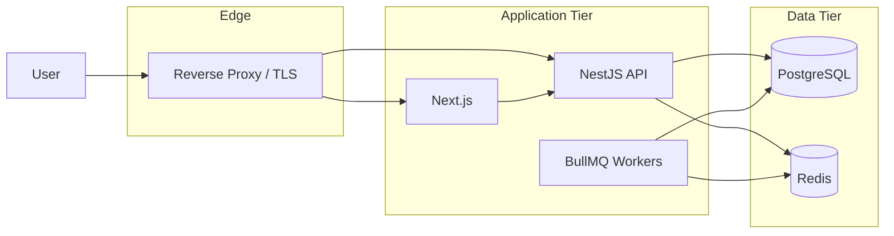

# Container & Deployment Diagram

## Purpose

Topology production selaras Phase 21.

## References

- docs/21-integration-deployment/002-docker-compose-production.md
- docs/02-product-architecture/005-deployment-architecture.md
- standards/deployment.md
