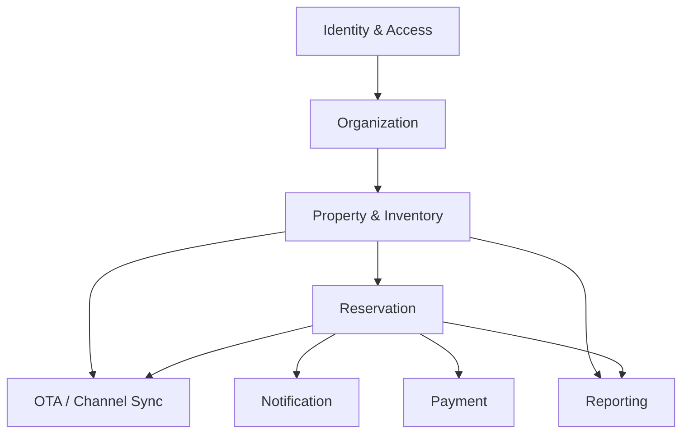

# Domain Modules Diagram

## Purpose

Bounded context utama ChannelHub.

## References

- docs/02-product-architecture/002-domain-architecture.md
- docs/02-product-architecture/003-microservice-boundary.md
- adr/ADR-007-event-driven-integration.md
