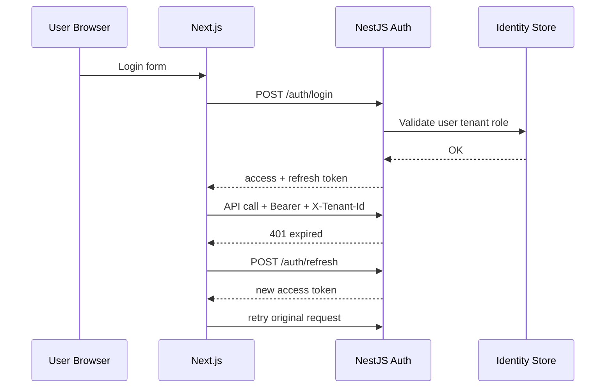

# Authentication Flow Diagram

## Purpose

Alur login dan token selaras frontend-backend integration.

## References

- docs/21-integration-deployment/001-frontend-backend-integration.md
- docs/16-api-contract/005-api-authentication-standard.md
- docs/22-security/002-authentication-hardening.md
