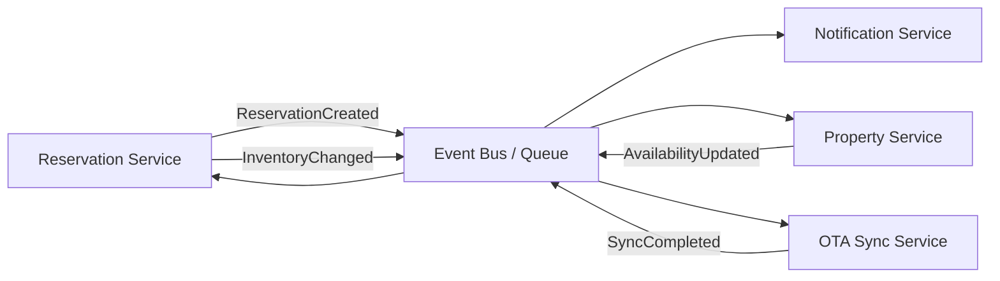

# Event Flow Diagram

## Purpose

Integrasi event-driven antar modul.

## References

- docs/09-database-api-contract/006-event-contract-design.md
- docs/17-core-services/008-event-driven-architecture.md
- adr/ADR-007-event-driven-integration.md
