# ChannelHub Canonical ERD

## Purpose

Menetapkan **model data kanonik** ChannelHub: daftar tabel resmi, kepemilikan domain, dan relasi antar tabel. Dokumen ini adalah satu-satunya sumber kebenaran untuk nama tabel dan relasi. DDL eksekusi ada di [010-postgresql-ddl-reference.md](./010-postgresql-ddl-reference.md), definisi field dan business rule ada di [002-domain-entity-design.md](./002-domain-entity-design.md).

## Scope

Seluruh tabel operasional platform pada satu database PostgreSQL logis, dengan boundary domain yang tetap dipertahankan agar siap dipecah menjadi microservice (ADR-001, ADR-003).

## Context

- Domain map: [docs/02-product-architecture/002-domain-architecture.md](../02-product-architecture/002-domain-architecture.md)
- Schema per domain (level konsep): [docs/09-database-api-contract/](../09-database-api-contract/)
- Isolasi tenant: [adr/ADR-006-multi-tenant-isolation.md](../../adr/ADR-006-multi-tenant-isolation.md)

## Rules

- Nama tabel pada dokumen ini bersifat final; dokumen lain wajib memakai nama yang sama.
- Setiap tabel tenant-owned memiliki kolom `organization_id` (tenant key) dan wajib difilter pada setiap query.
- Primary key `uuid` dengan default `gen_random_uuid()`.
- Setiap tabel memiliki `created_at`, `updated_at`; tabel yang dapat dihapus logis memiliki `deleted_at`.
- Tidak ada foreign key lintas domain kecuali yang tercantum pada bagian Cross-Domain Relationship.

## Technical Details

### Domain ownership

| Domain | Tabel |
| --- | --- |
| Identity | `users`, `roles`, `permissions`, `role_permissions`, `user_roles`, `sessions`, `audit_logs` |
| Organization | `organizations`, `organization_members`, `organization_settings` |
| Property | `properties`, `room_types`, `rooms`, `rate_plans`, `rate_calendar`, `inventory` |
| Reservation | `guests`, `booking_sources`, `reservations`, `reservation_rooms`, `reservation_events` |
| OTA Integration | `ota_channels`, `channel_connections`, `channel_mappings`, `sync_jobs`, `sync_logs`, `webhook_events` |
| Subscription | `subscription_plans`, `subscriptions`, `feature_entitlements` |
| Billing | `invoices`, `invoice_items`, `payments`, `credit_wallets`, `credit_transactions` |
| Notification | `notification_templates`, `notifications` |
| Platform Management | `feature_flags`, `menus`, `system_configurations` |

### Tenant classification

| Kelas | Arti | Tabel |
| --- | --- | --- |
| Global | Milik platform, tanpa `organization_id` | `permissions`, `ota_channels`, `subscription_plans`, `booking_sources`, `feature_flags`, `menus`, `system_configurations`, `notification_templates` |
| Tenant-owned | Wajib `organization_id` | seluruh tabel lain kecuali tabel relasi yang mewarisi tenant dari parent |
| Derived tenant | Tenant diturunkan dari parent (join) | `role_permissions`, `user_roles`, `reservation_rooms`, `reservation_events`, `invoice_items`, `credit_transactions`, `sync_logs` |

### Entity relationship

```mermaid
erDiagram
    organizations ||--o{ organization_members : has
    organizations ||--|| organization_settings : configures
    users ||--o{ organization_members : joins
    organizations ||--o{ roles : defines
    roles ||--o{ role_permissions : grants
    permissions ||--o{ role_permissions : granted_by
    users ||--o{ user_roles : assigned
    roles ||--o{ user_roles : assigned_to
    users ||--o{ sessions : authenticates
    users ||--o{ audit_logs : performs

    organizations ||--o{ properties : owns
    properties ||--o{ room_types : defines
    room_types ||--o{ rooms : contains
    room_types ||--o{ rate_plans : priced_by
    rate_plans ||--o{ rate_calendar : prices
    room_types ||--o{ inventory : stocked_as

    organizations ||--o{ guests : registers
    organizations ||--o{ reservations : records
    properties ||--o{ reservations : hosts
    guests ||--o{ reservations : books
    booking_sources ||--o{ reservations : originates
    reservations ||--o{ reservation_rooms : contains
    room_types ||--o{ reservation_rooms : allocated_from
    reservations ||--o{ reservation_events : logs

    ota_channels ||--o{ channel_connections : connected_via
    organizations ||--o{ channel_connections : configures
    channel_connections ||--o{ channel_mappings : maps
    channel_connections ||--o{ sync_jobs : triggers
    sync_jobs ||--o{ sync_logs : produces
    channel_connections ||--o{ webhook_events : receives

    subscription_plans ||--o{ subscriptions : instantiated_as
    organizations ||--o{ subscriptions : subscribes
    subscriptions ||--o{ feature_entitlements : entitles
    subscriptions ||--o{ invoices : billed_by
    invoices ||--o{ invoice_items : details
    invoices ||--o{ payments : settled_by
    organizations ||--|| credit_wallets : holds
    credit_wallets ||--o{ credit_transactions : records

    notification_templates ||--o{ notifications : renders
    organizations ||--o{ notifications : receives
```

### Cross-domain relationship

Relasi berikut adalah satu-satunya foreign key yang boleh melintasi boundary domain. Saat dipecah menjadi microservice, relasi ini berubah menjadi referensi id + event (ADR-007).

| Dari | Ke | Alasan | Saat microservice |
| --- | --- | --- | --- |
| `organization_members.user_id` | `users.id` | membership tenant | tetap FK di identity |
| `properties.organization_id` | `organizations.id` | tenant ownership | menjadi id reference |
| `reservations.property_id` | `properties.id` | reservation butuh property | menjadi id reference + `PropertyChanged` event |
| `channel_mappings.room_type_id` | `room_types.id` | mapping OTA ke room type | menjadi id reference |
| `subscriptions.organization_id` | `organizations.id` | subscription per tenant | menjadi id reference |
| `invoices.subscription_id` | `subscriptions.id` | tagihan atas subscription | menjadi id reference |

### Lifecycle enum

Nilai status berikut bersifat kanonik dan dipakai pada DDL, DTO, dan UI.

| Enum | Nilai |
| --- | --- |
| `user_status` | `PENDING`, `ACTIVE`, `SUSPENDED`, `DEACTIVATED` |
| `organization_status` | `TRIAL`, `ACTIVE`, `SUSPENDED`, `CLOSED` |
| `property_status` | `DRAFT`, `ACTIVE`, `INACTIVE`, `ARCHIVED` |
| `reservation_status` | `PENDING`, `CONFIRMED`, `CHECKED_IN`, `CHECKED_OUT`, `CANCELLED`, `NO_SHOW` |
| `subscription_status` | `TRIAL`, `ACTIVE`, `EXPIRING`, `EXPIRED`, `SUSPENDED`, `CANCELLED` |
| `invoice_status` | `DRAFT`, `ISSUED`, `PAID`, `OVERDUE`, `VOID` |
| `payment_status` | `PENDING`, `SUCCEEDED`, `FAILED`, `REFUNDED` |
| `sync_status` | `QUEUED`, `RUNNING`, `SUCCEEDED`, `FAILED`, `RETRYING` |
| `connection_status` | `DISCONNECTED`, `CONNECTED`, `ERROR`, `REVOKED` |
| `notification_status` | `QUEUED`, `SENT`, `FAILED`, `READ` |

`subscription_status` mengikuti lifecycle pada [docs/01-business/007-subscription-model.md](../01-business/007-subscription-model.md).

## Impact

- [docs/15-database-implementation/010-postgresql-ddl-reference.md](./010-postgresql-ddl-reference.md) — DDL wajib mengikuti tabel dan enum di sini.
- [docs/16-api-contract/009-api-endpoint-specification.md](../16-api-contract/009-api-endpoint-specification.md) — resource API memetakan tabel ini.
- [standards/database.md](../../standards/database.md) — review schema memakai daftar ini sebagai acuan.

## References

- [adr/ADR-003-postgresql-primary-database.md](../../adr/ADR-003-postgresql-primary-database.md)
- [adr/ADR-006-multi-tenant-isolation.md](../../adr/ADR-006-multi-tenant-isolation.md)
- [adr/ADR-007-event-driven-integration.md](../../adr/ADR-007-event-driven-integration.md)
- [docs/09-database-api-contract/001-database-domain-model.md](../09-database-api-contract/001-database-domain-model.md)
